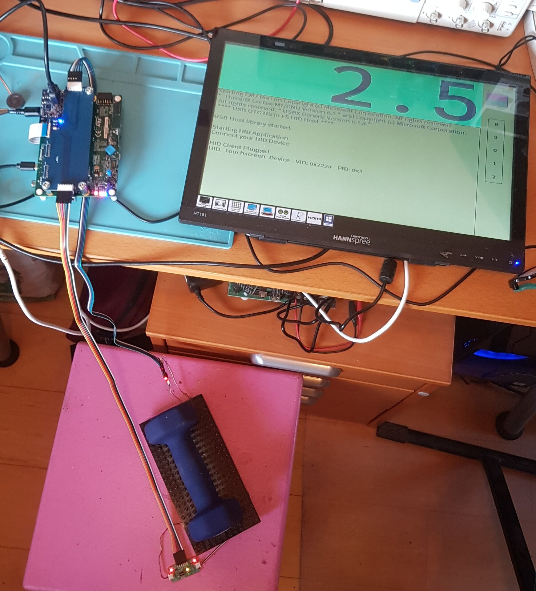
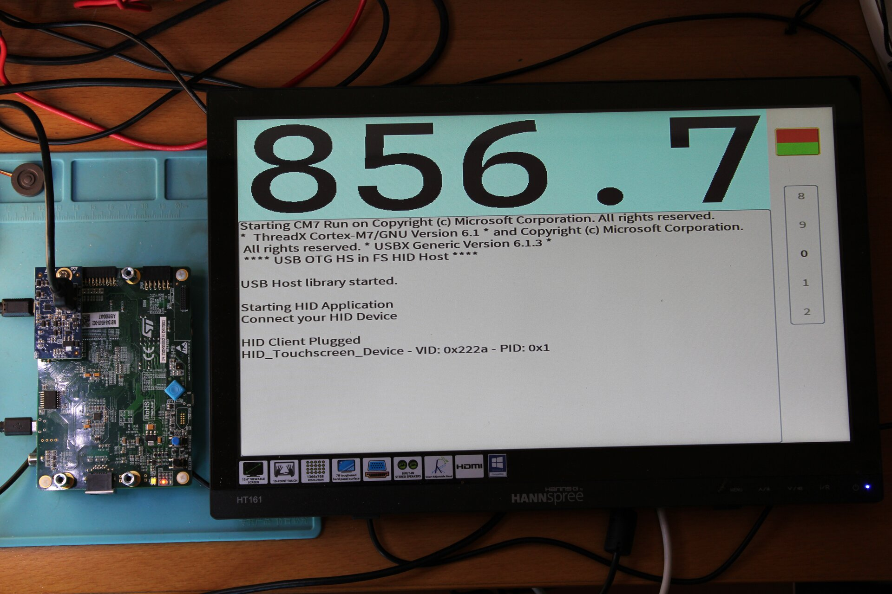
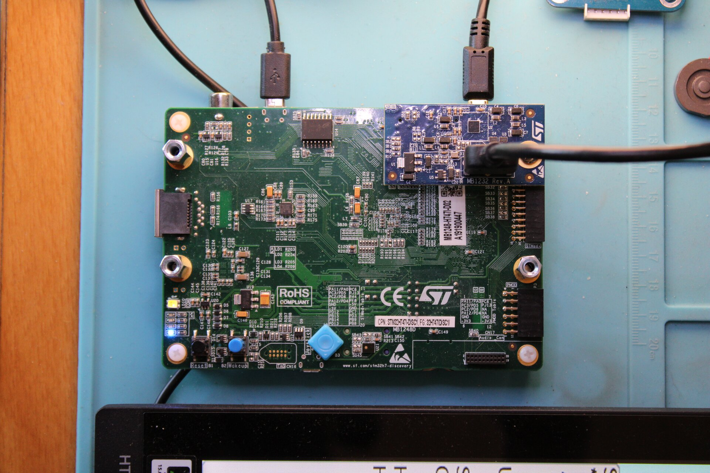

# H747-WeighingStation

The hardware setup is done using CubeMX to create the project with AzureRTOS
threadX enabled on both cores and USBX host mode for HID enabled on M7.  The
LTDC and HDMI are also configured from CubeMX.

- M4 will :
  1. toggle the orange LED twice per second using 1 tx thread
  2. write things on the UART once per second using 1 tx thread
  3. read data from I2C1 and put the retrieved data in shared memory for M7
     using 1 tx thread
  4. read data from I2C4, same as above

- M7 will :
  1. initialize usbx (using several tx threads) in host-only mode and handling
     mouse or touchscreen HID
  2. toggle blue LED once per second; retrieve touch screen data from the USB
     attached device and post PEN events for guix
  3. start guix using 1 tx thread and setup a timer to periodically update a
     displayed value obtained from the shared memory (I2C data sent by M4) --
     currently the I2C4 device is not connected to the board and the value of a
     counter is displayed instead

GUIX was added as a git submodule

The display is generated from GUIX Studio and the large font is also generated
by GS from the Cascadia Code font available here :
https://github.com/microsoft/cascadia-code/releases

## Complete setup

Here we see the H747 discovery board with HDMI interface, FFC interface board,
2 x 60 cm flat cables, 2 small I2C interface boards each attached to 2 load
cells (hidden under the black Lego board).  The HDMI touchscreen monitor is
connected via HDMI cable (for the display) and USB (for the touchscreen)

## board and touchscreen HDMI display view

---

## I2C interface boards

The small interface boards design is available on Open Source Hardware Lab

https://oshwlab.com/ciseli/i2c_dual_interface

The FFC interface board design is also available on Open Source Hardware Lab

https://oshwlab.com/ciseli/ffc_interface
